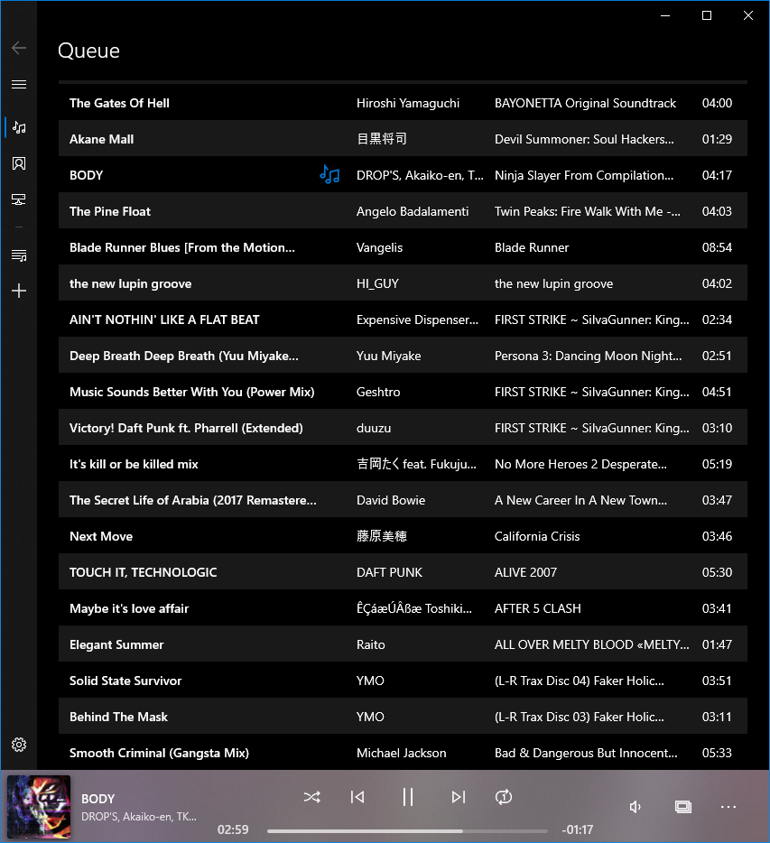
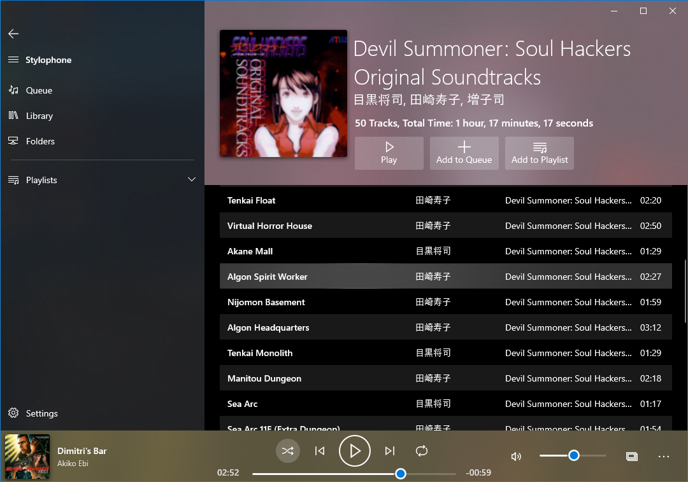
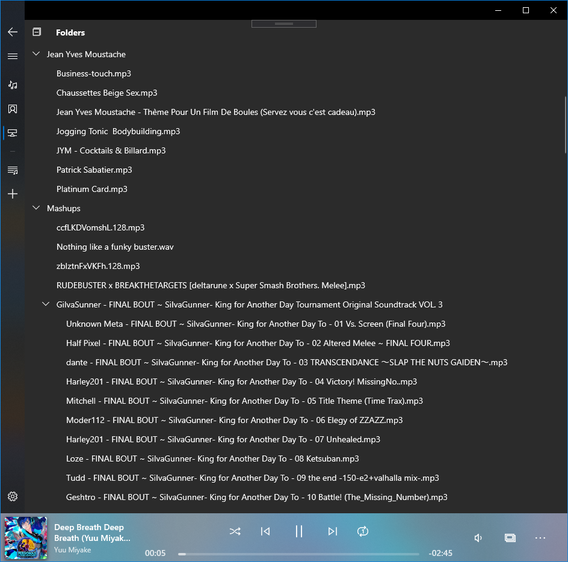
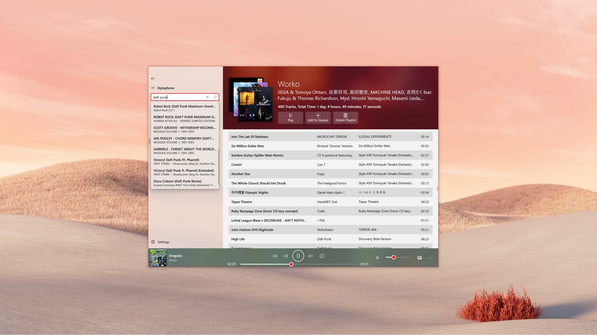
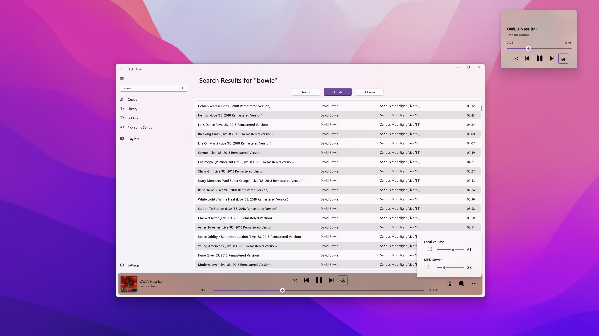
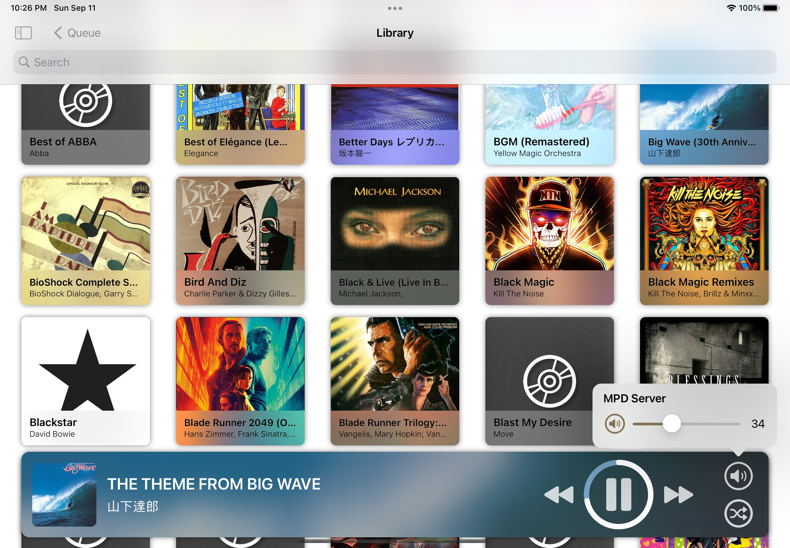

  
  
Stylophone
===========

[**Music Player Daemon**](https://www.musicpd.org/) Client for UWP.
Based on [MpcNET](https://github.com/petrkr/MpcNET), the original .NET Client Library for MPD.  

<a href='//www.microsoft.com/store/apps/9NCB693428T8?cid=storebadge&ocid=badge'></a>

## Features

* Full playback control  
* Playlist management (Create, Add/Remove tracks, Delete)  
* Picture-in-picture mode  
* Live tile  
* Browse library by albums, or directly by folders  
* All data is pulled from your MPD Server only  
* Support for both albumart and readpicture commands for maximum compatibility with your cover art library

## Usage with a locally hosted MPD server

If your MPD server is locally hosted, you're probably running into the issue where UWP apps can't access `localhost`.  
(See https://stackoverflow.com/questions/33259763/uwp-enable-local-network-loopback/33263253#33263253 for a summary.)
There is a workaround you can use with checknetisolation which should work:  

```
checknetisolation loopbackexempt -a -n="13459Difegue.Stylophone_zd7bwy3j4yjfy"
```  

## Screenshots








## Privacy Policy

Stylophone collects no data from your computer.  
The Windows Store version can send anonymized error reports related to crashes of the application back to me.  
