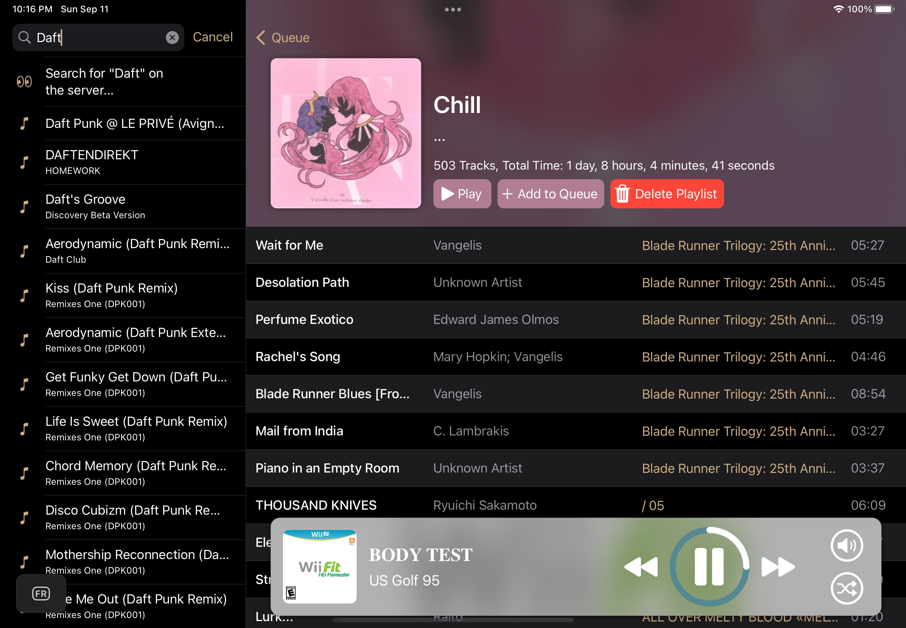
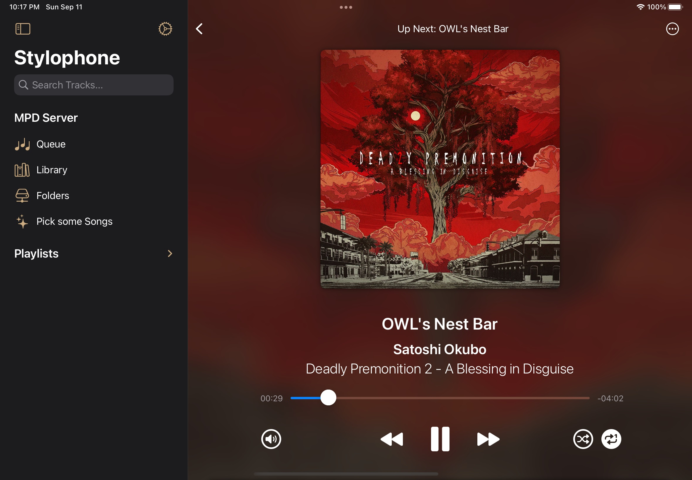
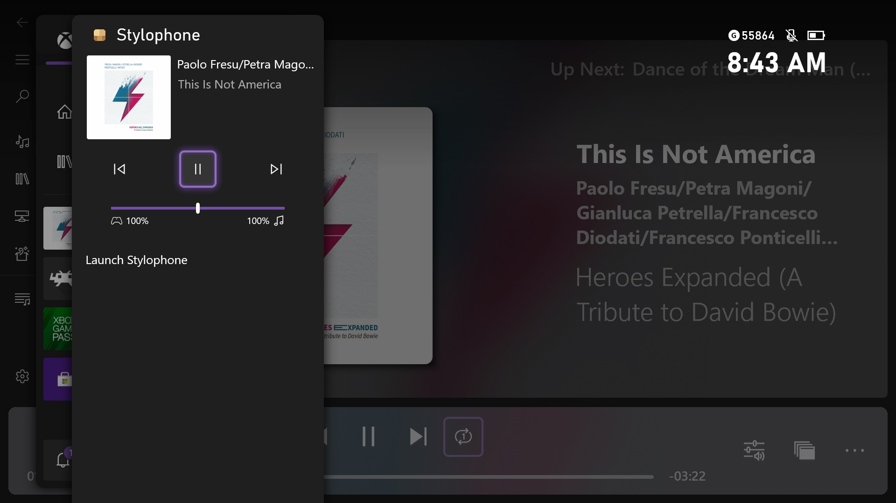
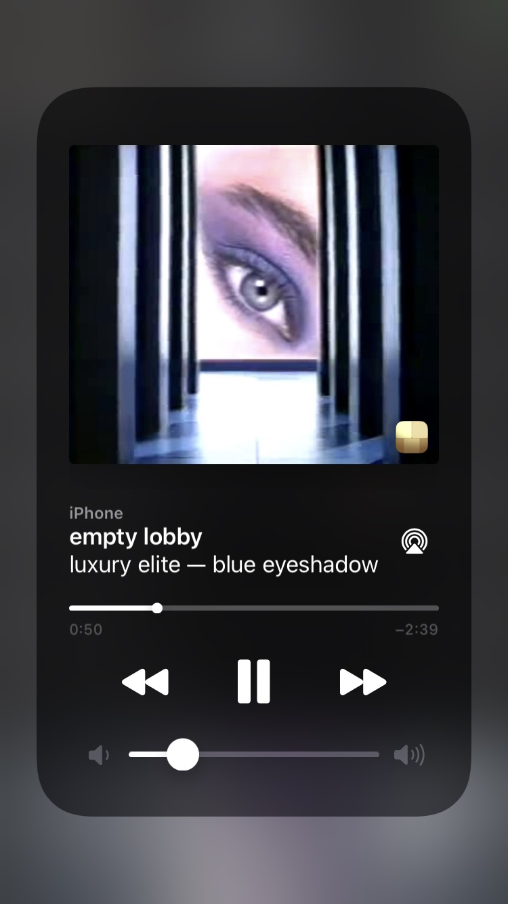

  
Stylophone
===========

[**Music Player Daemon**](https://www.musicpd.org/) Client for UWP and iOS/iPadOS.  
Based on [MpcNET](https://github.com/Difegue/MpcNET), my own fork of the original .NET Client Library for MPD. (now on NuGet!)   

[](https://www.microsoft.com/store/apps/9NCB693428T8?cid=storebadge&ocid=badge) [](https://apps.apple.com/us/app/stylophone/id1644672889?itsct=apps_box_link&itscg=30200)

[Buy a sticker if you want!](https://ko-fi.com/s/9fcf421b6e)  

## Features

* Full playback control  
* Playlist management (Create, Add/Remove tracks, Delete)  
* Picture-in-picture mode  
* Live tile on Windows 10
* Local playback support if your MPD server has `httpd` as an output
* Integration with native playback controls
* Browse library by albums, or directly by folders  
* All data is pulled from your MPD Server only  
* Support for both albumart and readpicture commands for maximum compatibility with your cover art library

## Usage with a locally hosted MPD server

If your MPD server is locally hosted, you're probably running into the issue where UWP apps can't access `localhost`.  
(See https://stackoverflow.com/questions/33259763/uwp-enable-local-network-loopback/33263253#33263253 for a summary.)
There is a workaround you can use with checknetisolation which should work:  

```
checknetisolation loopbackexempt -a -n="13459Difegue.Stylophone_zd7bwy3j4yjfy"
```  

## Protocol usage (Windows only)  

Stylophone can be launched through the `stylophone://` protocol on Windows devices; This feature also makes it so you can control some features of the app through protocol invocations.  

The following URLs are supported:  

- `stylophone://?verb=stylophone_play` or `stylophone://?verb=stylophone_pause` : Toggle playback status  
- `stylophone://?verb=stylophone_stop` : Stop playback
- `stylophone://?verb=stylophone_next` : Go to next track
- `stylophone://?verb=stylophone_prev` : Go to previous track
- `stylophone://?verb=stylophone_shuffle` : Toggle shuffle 
- `stylophone://?verb=stylophone_volume_up` : Raise volume
- `stylophone://?verb=stylophone_volume_down` : Lower volume  
- `stylophone://?verb=stylophone_volume_set&volume=50` : Set volume to desired value  
- `stylophone://?verb=stylophone_seek&seek=50` : Seek to desired position in current track 
- `stylophone://?verb=stylophone_load_playlistt&playlist=YourPlaylistName` : Load the desired playlist in queue  

## Translation

You can easily contribute translations to Stylophone! To help translate, follow these instructions.

### Adding a new language (requires Visual Studio 2019)
- Create a new issue with the subject `[Translation] fr-CA` where you replace `fr-CA` with whatever language-region code you'll be translating into.
    - If an issue already exists, then don't do this step.
- Fork and clone this repo
- Open in VS 2019
- In the `Stylophone.Localization` project, find the `Strings` folder.
- Create a new file inside `Strings` that looks like this: `Resources.en-US.resx` but using the language you're translating into.
- Copy all the existing data from `Resources.en-US.resx` into your new `Resources.[language].resx`
- Translate the strings from english to your language
- Once done, then commit > push > create pull request!

### Improving an existing language (can be done with any text editor)
- Fork and clone this repo
- Open the `.resx` file (e.g. `Resources.en-US.resx`) you want to edit. Choose any text editor
- Translate
- Commit > push > create pull request!

## Screenshots

|Queue, UWP | Queue, iOS |
|---|---|
|  |  |

|Library, UWP | Library, iOS |
|---|---|
|  |  |

|Playlist, UWP | Playlist, iOS |
|---|---|
| |  |

|Now Playing, UWP | Now Playing, iOS |
|---|---|
| |  |

|Xbox Integration | iOS Control Center Integration |
|---|---|
| |  |

## Privacy Policy  

If Telemetry is enabled in the app's settings, the application will send detailed crash reports using [App Center](https://appcenter.ms).  
Those reports can contain information about your hardware. (Motherboard type, etc)  

Stylophone collects no other data from your device.  
The Windows Store version can send anonymized error reports related to crashes of the application back to me.  
